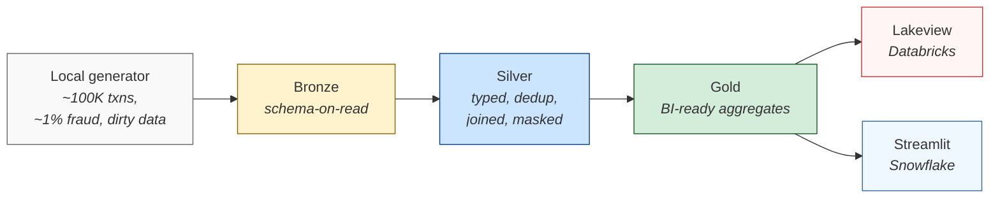

# Databricks vs Snowflake — A Hands-On Comparison

> **Cost target: ≤ $5 USD per full end-to-end run across both platforms.**

A side-by-side comparison of **Databricks** and **Snowflake**, built by running the same fraud-analytics workload end-to-end on both platforms. Same fictional fintech ("NorthWind Payments"), same synthetic data, same dbt models — only the engine differs. Cross-platform parity check asserts the gold tables match across both within 1e-4 tolerance.



> The dbt transformation layer (silver + gold + snapshots + tests) is **byte-identical** across both platforms — only the profile target differs. That's the cross-engine fairness control: the parity check passing means any architectural difference described in the comparison doc is a real platform difference, not an artifact of how the SQL was written.

## What This Comparison Argues

Most Databricks-vs-Snowflake comparisons are surface-level service mappings ("Delta = Iceberg, Lakeview = Snowsight, Auto Loader = Snowpipe"). That tells you nothing about *why* you'd pick one over the other for a specific workload.

This project compares architectural thinking by building. For each layer (ingest, transform, govern, serve), there's working code on both sides — and a written reasoning for which choice is load-bearing vs cosmetic.

The full comparison doc is at [`docs/architecture-comparison.md`](docs/architecture-comparison.md).

## Who This Is For

- Data engineers and architects evaluating the two platforms for a real workload
- Anyone tired of vendor decks and looking for hands-on, reproducible code
- Solutions architects who want a runnable reference to point at

## Repo Structure

```
.
├── docs/
│   └── architecture-comparison.md   # Main written comparison
├── data_generation/                 # Pure-Python synthetic generator
│   ├── generator.py                 # customers, merchants, transactions, fraud labels
│   ├── dirt.py                      # 6 deliberate-dirt modes
│   ├── ffiec.py                     # FFIEC bank reference fetcher
│   ├── cli.py                       # `npl-generate` CLI
│   └── tests/                       # 44 unit tests, no cloud dependencies
├── dbt/                             # Transformation spine (works on both engines)
│   ├── models/silver/               # Cleansed, joined, deduped
│   ├── models/gold/                 # BI-ready aggregates and KPIs
│   ├── snapshots/                   # SCD Type 2 customer history
│   └── macros/                      # Cross-engine helpers
├── databricks/
│   ├── bundle/                      # Databricks Asset Bundle (Auto Loader job)
│   ├── notebooks/                   # UC setup, masking, dashboard, cost telemetry
│   ├── dashboards/                  # Lakeview dashboard JSON
│   └── queries/                     # Verification SQL
├── snowflake/
│   ├── ddl/                         # Database/warehouse/stage/role setup
│   ├── notebooks/                   # COPY INTO, masking, cost telemetry
│   ├── streamlit/                   # Streamlit-in-Snowflake dashboard
│   └── queries/                     # Verification SQL
└── scripts/
    ├── parity_check.py              # Cross-platform comparison test
    └── teardown.sh                  # Drops everything on both platforms
```

## Quickstart

```bash
git clone https://github.com/btriani/databricks-snowflake-comparison
cd databricks-snowflake-comparison
cp .env.example .env       # then fill in DATABRICKS_* and SNOWFLAKE_* vars
make install               # uv sync
make generate              # ~10 sec; 100K txns + customers + merchants → ./data/landing/
make test                  # 44 unit tests, ~5 sec
```

To run on the cloud, you need a Databricks free trial workspace and a Snowflake free trial account. Each side runs independently — you can do just one if you only have credits for one.

## Run the Databricks Side

Prerequisites: Databricks free trial workspace; Personal Access Token in `.env`.

The Databricks Asset Bundle YAML at `databricks/bundle/databricks.yml` has the workspace URL hardcoded (DAB auth fields don't support `${env.DATABRICKS_HOST}` interpolation). Edit `targets.dev.workspace.host` to point at your workspace before running ingest.

```bash
make setup-databricks           # preflight + UC catalog/schemas/Volume
make ingest-databricks          # push to Volume + deploy bundle + run Auto Loader
make dbt-build                  # silver + gold via dbt-databricks
make apply-security             # masking functions + bind to PII columns
make deploy-dashboard           # AI/BI Lakeview dashboard at workspace root
make validate-cost              # query system.billing.usage for actual spend
```

Cost: ~$2 of trial credit per full end-to-end run (serverless SQL warehouse, ~5-7 min wall-clock).

## Run the Snowflake Side

Prerequisites: Snowflake free trial account; `.env` populated with `SNOWFLAKE_*` vars.

The dbt models from the Databricks side are reused unchanged — only the profile target differs. Bronze ingest uses `COPY INTO` from an internal stage (Snowpipe auto-ingest needs S3+SNS — out of scope for trial). Governance uses `CREATE MASKING POLICY` instead of UC `is_account_group_member()`. Dashboard is Streamlit-in-Snowflake instead of Lakeview.

```bash
uv tool install snowflake-cli           # one-time; conflicts with dbt-core if installed in project venv
make setup-snowflake                    # warehouse, database, stage, role, tag (idempotent)
make ingest-snowflake                   # PUT parquet to stage + COPY INTO bronze
make dbt-build-snowflake                # silver + gold via dbt-snowflake (same models)
make apply-security-snowflake           # masking policies on PII columns
make deploy-streamlit-snowflake         # Streamlit-in-Snowflake fraud overview
make validate-cost-snowflake            # query SNOWFLAKE.ACCOUNT_USAGE for actual spend
```

Cost: ~$1.50 of trial credit per full end-to-end run (XS warehouse with 60s auto-suspend).

**Heads-up on Snowflake setup:**
- The PAT requires an account-level `NETWORK_POLICY` before it can be used. Create a permissive one for trial: `CREATE NETWORK POLICY allow_all_for_pat ALLOWED_IP_LIST = ('0.0.0.0/0')` then `ALTER ACCOUNT SET NETWORK_POLICY = allow_all_for_pat`.
- `SNOWFLAKE_USER` is the `LOGIN_NAME` (uppercased, email stripped) — verify with `SELECT CURRENT_USER()` in Snowsight, not the email used at signup.
- `SNOWFLAKE_ACCOUNT` is the org-account form (`<org>-<account>`) extracted from the Snowsight URL, not the legacy locator.

## Cross-Platform Parity

```bash
make parity-check
```

Asserts that the gold tables produced by Databricks and Snowflake from the same dbt SQL match within 1e-4 relative tolerance. This is the load-bearing test for the comparison story — if it ever drifts, the side-by-side claims become unreliable.

```text
[parity] kpi_executive: rowcount + total fraud txn
  ✓ matched (3 cols: ['93', '1879', '96987'])
[parity] fct_fraud_daily: rowcount + total txn count
  ✓ matched (2 cols: ['53702', '96987'])
[parity] fct_merchant_exposure: rowcount + fraud_amt sum
  ✓ matched (2 cols: ['500', '237008.15'])
[parity] dim_customer_risk: rowcount
  ✓ matched (1 cols: ['5000'])

[parity] 4/4 checks passed (tolerance=0.0001)
```

## What's Different Across the Two Platforms

| Concern | Databricks | Snowflake |
|---|---|---|
| Bronze ingest | Auto Loader (cloudFiles, schema evolution) | `COPY INTO` from internal stage |
| Transformations | dbt-databricks (target `dev`) | dbt-snowflake (target `snowflake_dev`) — **same SQL** |
| PII masking | UC functions via `is_account_group_member()` | `CREATE MASKING POLICY ... CASE WHEN current_role() IN (...)` |
| Dashboard | AI/BI Lakeview (JSON-defined) | Streamlit-in-Snowflake (Python) |
| Cost telemetry | `system.billing.usage` filtered by `custom_tags['project']` | `SNOWFLAKE.ACCOUNT_USAGE.WAREHOUSE_METERING_HISTORY` filtered by `warehouse_name` |
| Compute | Serverless SQL warehouse | XS warehouse, AUTO_SUSPEND=60s |

The dbt transformation layer is byte-identical across both engines. See the [comparison doc](docs/architecture-comparison.md) for the architectural reasoning behind each row.

## Deliberate Dirt in the Bronze Data

Without injected dirt, both platforms trivially handle clean data and there's no architecture story.

| Dirt mode | Default rate | Where it ships |
|---|---|---|
| Nulls in `cc_num` and `amt` | 0.5% | `inject_nulls` |
| Duplicate `trans_num` | 1% | `inject_duplicates` |
| Late-arriving timestamps (1–3 days back) | 5% of rows split into separate file | `split_late_arrivers` |
| Schema evolution (v1 → v2) | Half of rows in v2 schema | `to_v2_schema` |
| Bad joins (orphan `cc_num`) | 2% | `inject_bad_joins` |
| Type drift (`amt` as `"$1,234.56"`) | 1% | `inject_type_drift` |

## Status

| Milestone | Scope | Status |
|---|---|---|
| Foundation | Local generator, dirt injection, repo skeleton | Complete |
| Databricks side | Auto Loader → bronze; dbt silver/gold; UC masking; Lakeview dashboard | Complete |
| Snowflake side | COPY INTO → bronze; dbt silver/gold; Horizon masking; Streamlit dashboard | Complete |
| Cross-platform parity check | 4 gold-table assertions, 1e-4 tolerance | Complete (4/4 pass) |
| Architecture comparison doc | [`docs/architecture-comparison.md`](docs/architecture-comparison.md) | Complete |
| Parallel native variants | DLT (Databricks) + Dynamic Tables (Snowflake), bonus PySpark/Snowpark notebooks | Planned |

## Cost & Teardown

```bash
make teardown   # drops everything: local data/landing/, Databricks catalog + bundle + dashboard, Snowflake database + warehouse + role + Streamlit app
```

Or per-platform:

```bash
make teardown databricks   # only Databricks
make teardown snowflake    # only Snowflake
make teardown local        # only ./data/landing/
```

Hard guardrails are baked in: auto-stop ≤5min on Databricks, AUTO_SUSPEND=60s on Snowflake, default 100K-row dev volume, the large 10M-row mode behind an explicit `make generate-large`.

## License

MIT.

---

*Bruno Triani — May 2026*
