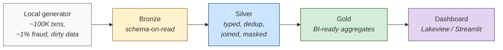
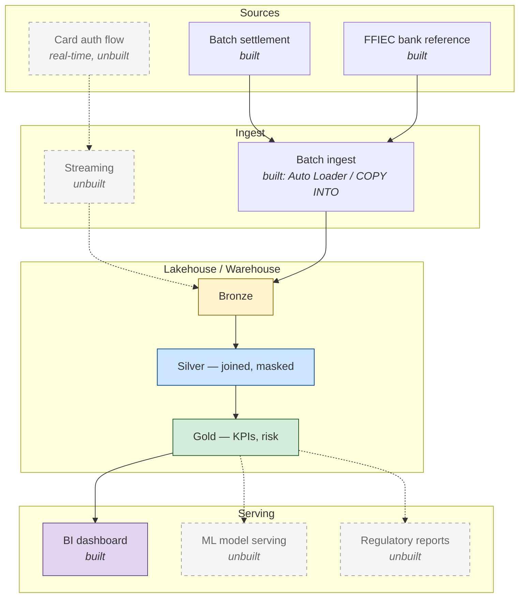
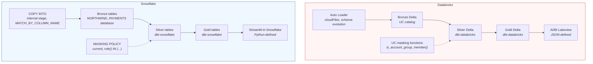
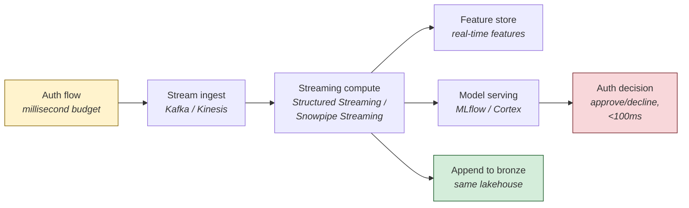

# Building NorthWind on Both Platforms — An Implementation Walkthrough

> **Looking for "how do I choose between Databricks and Snowflake?"** That's a different question and lives in the **[Decision Framework](decision-framework.md)** — seven discovery questions plus a fit matrix for the four major platforms. **This document is the walkthrough of what I actually built**: the reference architecture I'd draw on a whiteboard, the side-by-side implementation reality, and three worked design exercises that go deeper than a framework can.



## Why I Built This Twice

I wanted to feel the seams between Databricks and Snowflake, not read about them. The two platforms are positioned as direct competitors but built on different conceptual foundations:

| Platform | Centers | IDE flavor |
|---|---|---|
| **Databricks** | The *lakehouse* — Delta files in object storage, Spark compute | Notebooks |
| **Snowflake** | The *managed warehouse* — proprietary table format, separated compute/storage | SQL worksheets |

Both *can* do anything; the interesting question is what each one's defaults push you toward. So I built the same fictional fintech (NorthWind Payments) end-to-end on both, costing single-digit dollars total, and wrote down what I learned. The repo proves both pipelines work; this doc explains the reasoning.

---

## 1. Reference Architecture (Helicopter View)

The full NorthWind Payments platform — built parts solid, unbuilt parts dashed.



NorthWind is positioned as a mid-size payment processor (~5M cards, ~50K merchants, ~10M txns/day at the high end). The boxes above are platform-agnostic — the reference architecture survives a platform swap. The interesting platform-specific differences live one layer deeper, in **how** each box is implemented.

---

## 2. The Built Slice — Side by Side

The fraud-analytics slice on each platform.



The dbt models (silver + gold + snapshots + tests) are **byte-identical** across both platforms — only the profile target differs (`dev` vs `snowflake_dev`). That's the cross-engine fairness control: when the gold tables come out the same on both, you know the difference isn't in the SQL, it's in the engine and the surrounding platform.

The cross-platform parity check asserts this directly:

```text
$ make parity-check

[parity] kpi_executive: rowcount + total fraud txn
  ✓ matched (3 cols: ['93', '1879', '96987'])
[parity] fct_fraud_daily: rowcount + total txn count
  ✓ matched (2 cols: ['53702', '96987'])
[parity] fct_merchant_exposure: rowcount + fraud_amt sum
  ✓ matched (2 cols: ['500', '237008.15'])
[parity] dim_customer_risk: rowcount
  ✓ matched (1 cols: ['5000'])

[parity] 4/4 checks passed (tolerance=0.0001)
```

Same SQL → same gold → byte-identical aggregates. From here on, any architectural difference described is a real platform difference.

---

## 3. Choices the Framework Doesn't Cover

Two decisions came up during the build that the [decision framework](decision-framework.md) doesn't address directly — they live one layer below the platform choice. Worth their own tables.

### 3.1 Which Transformation Engine? (dbt vs DLT vs Dynamic Tables vs Notebook)

| Engine | Pick when… | Avoid when… |
|---|---|---|
| **dbt** (works on both) | • Want portable SQL across engines<br/>• Small team comfortable in SQL<br/>• Tests as first-class | • Need orchestration with conditionals/branching (dbt does DAGs, not workflows) |
| **DLT** (Databricks) | • Want declarative pipelines + built-in expectations + lineage<br/>• Committed to Databricks | • Cross-platform portability matters<br/>• Don't want to learn a DSL |
| **Dynamic Tables** (Snowflake) | • Same as DLT but on Snowflake<br/>• Want target-lag-driven incremental refresh out of the box | • Cross-platform portability matters |
| **Notebook / Spark code** | • Prototyping, ML feature engineering, one-off heavy compute | • The transformation will live in production for years |

> **What this repo did:** dbt as the spine — it's the most defensible "build it once, run it anywhere" answer, and the parity check proves the portability is real.

### 3.2 Platform-Native vs External BI

| Tool | Pick when… | Avoid when… |
|---|---|---|
| **Lakeview / Streamlit-in-Snowflake** (platform-native) | • Dashboards must be code-deployable + source-controllable<br/>• Want SQL warehouse pricing<br/>• Audience already lives in the platform UI | • Need cross-platform semantic layer<br/>• Org has standardized on a different BI tool |
| **Snowsight Dashboards** (Snowflake-only) | • Pure-UI dashboard for analysts<br/>• No git-versioning requirement | • Want source-controllable dashboards (no clean API surface) |
| **External BI** (Tableau, Power BI, Looker) | • Org already standardized on the tool<br/>• Semantic layer matters more than platform-native UI<br/>• Cross-platform analytics is a real requirement | • Trying to stay inside one platform's pricing umbrella<br/>• Small team without an existing BI tooling investment |

> **What this repo did:** Lakeview on Databricks (JSON-defined, code-deployable) and Streamlit-in-Snowflake on Snowflake (Python-defined, code-deployable). External BI documented but not exercised — the comparison is about the platform-native paths.

---

## 4. Worked Architectural Design Exercises

Three design questions that go deeper than the framework's bullet-form coverage. The framework gives you the answer in 30 seconds; this is the 5-minute version with the diagram.

### 4.1 — Designing Fraud Detection from Scratch

The structure is the medallion model from the diagrams: **bronze** for raw inbound transactions (no transformation, schema-on-read so dirty data is preserved for replay), **silver** for cleansed/deduped/enriched transactions joined against customer + merchant + bank dimensions, **gold** for the BI-ready aggregates that drive the dashboard and downstream consumers.

The interesting design choices are the ones the spec doesn't dictate:

| Question | This repo's answer | Why |
|---|---|---|
| Where does dedup happen? | **Silver, not bronze** | Bronze should be append-only and idempotent — re-ingesting the same file should not corrupt history. Silver is where business logic lives. |
| What about late-arriving data? | **Same dedup pattern**, last-write-wins by `_ingest_timestamp` | Gold is rebuilt from silver each run, so late-arrivers naturally land in the right historical window. |
| What's gold actually for? | **4 tables, each with a clear consumer** — `kpi_executive` (one row/day), `fct_fraud_daily` (category × geography), `fct_merchant_exposure`, `dim_customer_risk` | Avoid building gold tables speculatively — every gold table is a maintenance burden. |
| Where does the dashboard live? | **Code-deployed alongside the rest** | UI-clicked dashboards are a moral hazard — nobody knows when they changed or whether the underlying SQL still produces sensible results. |

### 4.2 — Now Make It Real-Time

The batch pipeline doesn't make this slot in. Real-time changes the *shape* of the architecture, not just the latency dial.



The batch silver/gold pipeline still exists — for retrospective analytics, model retraining, regulatory reporting. The streaming pipeline runs in parallel and drops into the same bronze, enriching it for the batch consumers. The real-time path's "gold" is a model decision, not an aggregate table.

The platform integration story:

| Platform | Streaming integration | Trade-off |
|---|---|---|
| **Databricks** | Structured Streaming + Delta Live Tables + MLflow Model Serving — **same workspace, same SQL** | A few annotations away from the batch code |
| **Snowflake** | Snowpipe Streaming + Dynamic Tables + Cortex — **three discrete primitives that compose** | Many shops add Kafka + a sidecar feature store to bridge the gap |

> **Bottom line:** if real-time is near-term, Databricks wins on integration. If real-time is hypothetical and SQL-team productivity is the daily reality, Snowflake doesn't punish you for skipping it.

### 4.3 — Layering Governance + Audit

Three layers, both platforms support all three:

| Layer | What it does | How it shows up |
|---|---|---|
| **1. Tag columns** | PII columns (`cc_num`, `first`, `last`, `street`, `dob`) are tagged in both platforms | Tags drive policy and surface in lineage UIs so reviewers can see which downstream tables inherit the tag |
| **2. Mask at the column level** | Both platforms mask the actual column, not a separate view | Strictly better than view-based masking — the source-of-truth table is the only thing being protected; every consumer (BI, notebook, ad-hoc query) sees the same protected view |
| **3. Audit via the platform's access log** | Databricks: `system.access.audit` + `system.access.column_lineage`<br/>Snowflake: `ACCOUNT_USAGE.ACCESS_HISTORY` | Both let you reconstruct "who saw what when" |

The actual demo in this repo: as a workspace/account admin without the privileged role/group, both platforms return masked values:

| Column | Unmasked (privileged) | Masked (default) |
|---|---|---|
| `cc_num` | `4111111111116114` | `************6114` |
| `first` | `Elizabeth` | `REDACTED` |
| `last` | `Montoya` | `REDACTED` |
| `street` | `66765 Shawn Expressway` | `REDACTED` |
| `dob` | `1992-11-08` | `NULL` |

That's the proof — masking isn't a UI artifact, it's enforced at the data layer.

**The thing that doesn't translate cleanly:** Unity Catalog thinks in **groups**, Horizon thinks in **roles**. Roles can be token-bound (Snowflake PATs are scoped to a single role), which means demoing the masked vs unmasked view in Snowflake from a CLI requires two PATs — one in the privileged role, one outside. UC group membership is checked per-query against the calling user, no token gymnastics required.

---

## 5. Stretch — Unbuilt Extensions

Documented for completeness; intentionally not coded.

| Extension | What it'd add | Why I didn't build it |
|---|---|---|
| **Streaming auth-flow scoring** | Real-time fraud decision in the auth path (~100ms budget) | Different architecture shape; would need Kafka/Kinesis + a feature store. Out of scope. |
| **ML-based fraud model serving** | Replace the rule-based risk score with a trained classifier (MLflow on Databricks, Cortex on Snowflake) | Each platform has a very different ML story — would dilute the comparison. Worth its own study. |
| **Regulatory reporting (SAR-style)** | Suspicious-activity-report extracts in the format banks file with FinCEN | Pure SQL on top of gold; no architectural insight gained. |
| **AWS-native variant** | Same workload on Glue + Redshift + S3 + Athena | Three-way comparison would triple scope. Could be a follow-up. |
| **DLT + Dynamic Tables variants** | Parallel pipelines using each platform's flagship declarative-pipeline pattern | Planned next milestone for this study. |
| **TPC-DI second dataset** | Brokerage/financial-services synthetic data for a different domain | Sparkov + FFIEC is enough to make the architectural points. |

---

## Source

- Repo root: [`README.md`](../README.md) — quickstart and structure
- Sister doc: [`docs/decision-framework.md`](decision-framework.md) — the "how to choose" version
- Total spend at the time of writing: ~$1.50 across both platforms

---

*Bruno Triani — May 2026*
