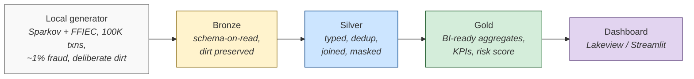
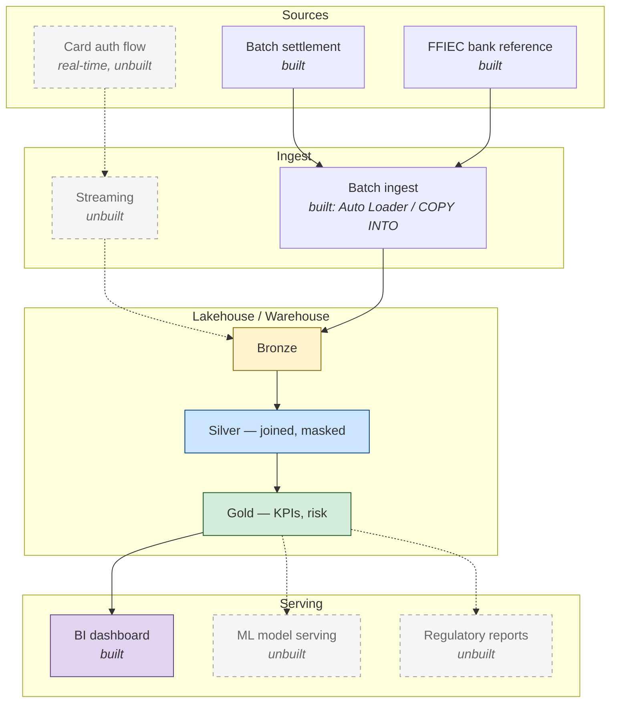
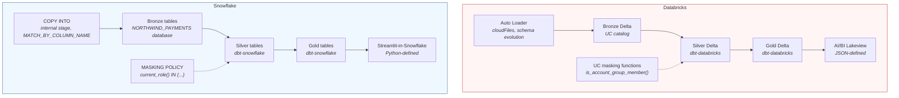
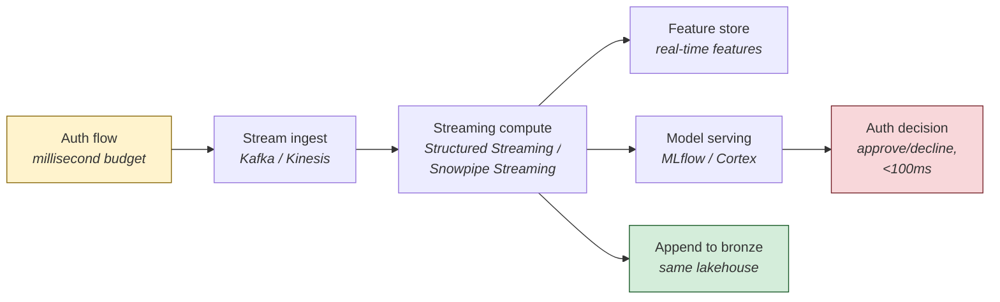

# Databricks vs Snowflake — An Architecture Comparison

A first-person walkthrough of building the same fraud-analytics workload end-to-end on Databricks and Snowflake. Same fictional fintech ("NorthWind Payments"), same synthetic data, same dbt models — only the platform differs. The point is to compare honestly: where the two platforms converge, where they diverge, and which choices are load-bearing vs. cosmetic.



> Same medallion shape on both platforms. The interesting question isn't "which platform can do this?" — both can. The interesting question is **what each platform's defaults push you toward**, and whether their respective answers to ingestion, governance, and serving converge or diverge.

## Why This Exists

I wanted to know — for myself, not from vendor decks — what it actually feels like to build the same data pipeline on Databricks and Snowflake. The two platforms are positioned as direct competitors but they're built on different conceptual foundations: Databricks centers the *lakehouse* (Delta files in object storage, Spark compute, notebooks-as-IDE), Snowflake centers the *managed warehouse* (proprietary table format, separated compute/storage, SQL-as-IDE). I wanted to feel the seams.

So I built the same fraud-analytics slice on both, costing single-digit dollars total. Concretely:

- A fictional payment processor (NorthWind Payments) generates ~100K synthetic credit-card transactions with deliberately dirty data (nulls, duplicates, schema evolution, currency-formatted strings).
- Bronze ingest is platform-native (Auto Loader on Databricks, `COPY INTO` on Snowflake).
- Silver and gold transformations are written **once in dbt** and run identically against both engines — this is the cross-engine fairness control.
- PII governance uses each platform's masking primitive (Unity Catalog functions on Databricks, `MASKING POLICY` on Snowflake).
- Each side ships a code-deployed dashboard (Lakeview on Databricks, Streamlit-in-Snowflake on Snowflake).
- A Python parity check asserts the gold tables match across both platforms within 1e-4 tolerance.

This document is the architectural reasoning that the code repo *can't* show by itself. The repo proves both pipelines work; this doc explains which trade-offs I'd make under what circumstances.

## What's in Scope (and What Isn't)

**Built and runnable in the repo:**

- Bronze ingest, silver/gold dbt models, governance, dashboards on both platforms.
- Cross-platform parity check.
- Cost telemetry on both sides.

**Documented but unbuilt** (named in the [Stretch](#stretch--unbuilt-extensions) section, intentionally not coded):

- Streaming auth-flow scoring (Structured Streaming vs Snowpipe Streaming).
- ML-based fraud model serving (MLflow Model Serving vs Snowflake Cortex).
- Regulatory reporting (SAR-style suspicious activity reports).
- AWS-native variant (Glue + Redshift + S3 + Athena).
- DLT (Databricks) and Dynamic Tables (Snowflake) parallel pipelines — *planned for M4 of this study*.

**Explicitly out of scope:**

- Performance benchmarking. We *observe* cost/duration and *report* what we saw — never as an apples-to-apples benchmark.
- Real PII. All data is synthetic; the masking story demonstrates the *governance surface*, not real-world PII protection.
- Production-grade infra. No Terraform, no CI/CD, no observability stack. The point is architectural reasoning, not platform-engineering ergonomics.

---

## 1. Reference Architecture (Helicopter View)

The full NorthWind Payments platform — built parts solid, unbuilt parts dashed.



NorthWind is positioned as a mid-size payment processor (~5M cards, ~50K merchants, ~10M txns/day at the high end). The boxes above are platform-agnostic — the reference architecture survives a platform swap. The interesting platform-specific differences live one layer deeper, in **how** each box is implemented.

## 2. Built Slice — Side by Side

The fraud-analytics slice we actually built, on each platform.



The dbt models (silver + gold + snapshots + tests) are **byte-identical** across both platforms. Only the profile target differs (`dev` vs `snowflake_dev`). That's the cross-engine fairness control: when the gold tables come out the same on both platforms, you know the difference isn't in the SQL, it's in the engine and the surrounding platform.

The cross-platform parity check asserts this directly:

```text
$ make parity-check

[parity] kpi_executive: rowcount + total fraud txn
  ✓ matched (3 cols: ['93', '1879', '96987'])
[parity] fct_fraud_daily: rowcount + total txn count
  ✓ matched (2 cols: ['53702', '96987'])
[parity] fct_merchant_exposure: rowcount + fraud_amt sum
  ✓ matched (2 cols: ['500', '237008.15'])
[parity] dim_customer_risk: rowcount
  ✓ matched (1 cols: ['5000'])

[parity] 4/4 checks passed (tolerance=0.0001)
```

Same SQL → same gold → byte-identical aggregates across both engines. From here on, any architectural difference I describe is a real platform difference, not an artifact of how I wrote the transformations.

---

## 3. Decision Tables

Four tight tables. Each row: option / when I'd pick it / when I wouldn't / cost or complexity note.

### 3.1 — Ingestion

| Option | Pick when | Avoid when | Note |
|---|---|---|---|
| **Auto Loader** (Databricks) | Cloud storage as landing zone; schema may evolve; want exactly-once; want spinning-up handled | You want sub-second latency (use Snowpipe Streaming or Spark Structured Streaming) | Delta-only target. Schema inference is opt-in but lossy on first run — review before promoting to silver. |
| **Snowpipe** (auto-ingest) | S3/Azure landing with SNS/EventGrid; want per-file load tracking; OK with seconds-to-minutes latency | You don't have an external object store (auto-ingest needs S3+SNS, not Snowflake internal stage) | The trial-friendly fallback is `COPY INTO` from internal stage, run on a scheduled task. That's what this repo does. |
| **Snowpipe Streaming** | Sub-second row-level ingest from app code | You're moving files (use Snowpipe); you need transactional updates (use Dynamic Tables) | Newer, requires SDK integration. Pricing model is per-row + warehouse-credit hybrid. |
| **Fivetran / Stitch** | Source is a SaaS connector that already exists; you don't want to maintain extraction code | You can write the extraction in 50 lines; budget is tight; transformations need to live near the source | Both Databricks and Snowflake market Partner Connect to make this push-button. |

### 3.2 — Transformation Engine

| Option | Pick when | Avoid when | Note |
|---|---|---|---|
| **dbt** (works on both) | You want portable SQL; you have a small team that can read SQL; you want tests as first-class | You need orchestration with conditionals/branching (dbt does DAGs, not workflows) | The most defensible "build it once, run it anywhere" answer. This repo's silver+gold proves it. |
| **DLT** (Databricks) | You want declarative pipelines with built-in expectations and lineage; you're committed to Databricks | Cross-platform portability matters; you don't want to learn another DSL | Same SQL as dbt but with `@dlt.table` decorators and `expect_or_drop`. Replaces the orchestration layer dbt doesn't have. |
| **Dynamic Tables** (Snowflake) | Same as DLT but on Snowflake; want target-lag-driven incremental refresh out of the box | Cross-platform portability matters | The clean Snowflake equivalent of DLT. SQL-only — no Python decorators. |
| **Notebook / Spark code** | Prototyping; ML feature engineering; one-off heavy compute | The transformation will live in production for years (use dbt or DLT/DT) | Hard to test, hard to version meaningfully. Useful as the bonus PySpark/Snowpark depth proof, not as a production pattern. |

### 3.3 — Governance & PII

| Capability | Databricks (Unity Catalog) | Snowflake (Horizon) |
|---|---|---|
| Column masking | Function returning masked value, bound via `ALTER TABLE ... ALTER COLUMN ... SET MASK` | `CREATE MASKING POLICY ... CASE WHEN current_role() IN (...)`, bound via `ALTER TABLE ... MODIFY COLUMN ... SET MASKING POLICY` |
| Authorization signal | `is_account_group_member('group_name')` — group membership | `current_role() IN ('ROLE_NAME', ...)` — active role |
| Admin bypass | None automatic — workspace admins see masked output unless explicitly added to the group | Same — ACCOUNTADMIN sees masked output unless explicitly named in the policy |
| Lineage UI | Yes (UC catalog browser shows masked columns flowing through silver/gold) | Yes (`ACCESS_HISTORY` view shows policy hits, but no UI visualization) |
| Tagging | Object tags on catalogs/schemas/tables/columns | Object tags on most objects; policy attached via tag is supported |
| Talk-track summary | "Group-membership-driven, function-based masking. Workspace admins are not automatically privileged." | "Role-driven, policy-based masking. Roles are token-bound — PATs in one role cannot switch to another in the same session." |

The mental model: Databricks asks *"is this user in the right group?"* — Snowflake asks *"is the current role in the allowlist?"* Both give you the same outcome (masked or unmasked) but the unit of authorization is different (group vs role), which affects how you'd design the surrounding access management.

### 3.4 — Serving / BI

| Option | Pick when | Avoid when | Note |
|---|---|---|---|
| **Lakeview / AI/BI** (Databricks) | Dashboards must be code-deployable; want native to the platform; want SQL warehouse pricing | You want Streamlit-style interactivity (use a notebook or external app) | Dashboard is JSON; widget schema is undocumented and brittle. Cribbing from a working dashboard via the API is the only reliable path. |
| **Streamlit-in-Snowflake** | Dashboards must be code-deployable; want Python-first interactivity; want the Snowflake-native pattern | The audience is non-technical analysts who'd struggle with a Python codebase | The modern Snowflake answer. Deployable via `snow streamlit deploy --replace`. Same dataset can drive a Snowsight dashboard if pure UI is preferred. |
| **Snowsight Dashboards** (Snowflake) | Pure-UI dashboard for analysts; no API requirement | You want git-versioned dashboard definitions (no clean API) | Dashboards are UI-defined. Functional but not source-controllable in the same way as Lakeview or Streamlit. |
| **External BI** (Tableau, Power BI, Looker) | Org already standardized on the tool; semantic layer matters more than platform-native UI | You're trying to stay inside one platform's pricing umbrella | All three platforms ship native connectors. The question is org politics, not architecture. |

---

## 4. Architectural Reasoning, by Question

The four questions a thoughtful reader would ask after seeing the diagrams.

### "Design fraud detection for a mid-size payment processor."

The structure is the medallion model from the diagrams: **bronze** for raw inbound transactions (no transformation, schema-on-read so dirty data is preserved for replay), **silver** for cleansed/deduped/enriched transactions joined against customer + merchant + bank dimensions, and **gold** for the BI-ready aggregates that drive the dashboard and downstream consumers.

The interesting design choices are the ones the spec doesn't dictate:

1. **Where does dedup happen?** I put it in silver, not bronze. Bronze should be append-only and idempotent — re-ingesting the same file should not corrupt history. Silver is where business logic lives, including "the same trans_num appearing twice means the second one is the dupe."
2. **What about late-arriving data?** The dirt-injection generates ~5% of rows shifted backward by 1-3 days. Silver handles them via the same dedup pattern (last-write-wins by `_ingest_timestamp`); gold is rebuilt from silver each run, so late-arrivers naturally land in the right historical window.
3. **What's gold actually for?** Four tables: an executive KPI table (one row per day with totals + fraud rate + top-3 risky merchants), a daily fact at category × geography granularity, a per-merchant fraud-exposure fact, and a customer risk score. Each has a clear consumer. Avoid building gold tables speculatively — every gold table is a maintenance burden.
4. **Where does the dashboard live?** Code-deployed alongside the rest. If the dashboard is something an analyst clicks together in the UI, it's a moral hazard — nobody knows when it changed or whether the underlying SQL still produces sensible results. Lakeview JSON and Streamlit Python are both source-controllable.

### "Why Databricks over Snowflake here?" (and the inverse)

Honest answer: **for this specific workload, both are fine.** The dbt parity check confirms it. The interesting differences are second-order:

**Databricks pulls ahead when:**
- The workload is mixed batch + ML + ad-hoc Spark. Notebooks are first-class; Spark is the substrate; MLflow lives in the same workspace.
- You'd rather pay for compute time than per-credit warehouse seconds. Job clusters terminate aggressively; the unit-economics fit pipelines that run on demand.
- You care about the lakehouse story — Delta files in your own object store, queryable from anything that speaks Delta or Iceberg.

**Snowflake pulls ahead when:**
- The workload is overwhelmingly SQL with strict separation between transform and serve. The warehouse model is genuinely good at scaling concurrency for BI without affecting ETL.
- You want zero infrastructure. Even Databricks SQL warehouses involve more knobs (Photon on/off, auto-stop, channel) than `WAREHOUSE_SIZE = 'XSMALL' AUTO_SUSPEND = 60`.
- The org already speaks SQL (analytics, finance, RevOps) and resisting Python is the path of least friction.

The honest version of the answer for *NorthWind specifically*: Databricks has a slight edge because we'd want to bolt on real-time fraud scoring later (Structured Streaming → MLflow Model Serving is a cleaner path than Snowpipe Streaming → Cortex for that pattern, today). If the org were pure card-issuing with no real-time aspiration, Snowflake's lower operational burden would tilt the other way.

### "Now make it real-time."

The batch pipeline doesn't make this slot-in. Real-time changes the *shape* of the architecture, not just the latency dial.



The batch silver/gold pipeline still exists — for retrospective analytics, model retraining, regulatory reporting. The streaming pipeline runs in parallel and drops into the same bronze, enriching it for the batch consumers. The real-time path's "gold" is a model decision, not an aggregate table.

The platform difference here is genuine:
- **Databricks**: Structured Streaming + Delta Live Tables + MLflow Model Serving — same workspace, same SQL, a few annotations away from the batch code.
- **Snowflake**: Snowpipe Streaming for ingest + Dynamic Tables for refresh + Cortex for model inference — three discrete primitives that compose, but not as smoothly as the Databricks side. Many shops add Kafka + a sidecar feature store to bridge the gap.

If real-time is a near-term plan, Databricks wins this one on integration. If real-time is hypothetical and SQL-team productivity is the daily reality, Snowflake doesn't punish you for skipping it.

### "How do you handle PII / governance / audit?"

Three layers:

1. **Tag columns.** PII columns (`cc_num`, `first`, `last`, `street`, `dob`) are tagged in both platforms. Tags drive policy; they also surface in lineage UIs so reviewers can see which downstream tables inherit the tag.
2. **Mask at the column level, not the table level.** Both platforms support column-level masking that returns a masked value to non-privileged callers. This is strictly better than view-based masking because the source-of-truth table is the only thing being protected — every consumer (BI, notebook, ad-hoc query) sees the same protected view.
3. **Audit via the platform's access log.** Databricks has `system.access.audit` and `system.access.column_lineage`; Snowflake has `ACCOUNT_USAGE.ACCESS_HISTORY`. Both let you reconstruct "who saw what when."

The actual demo in this repo: as a workspace/account admin without the privileged role/group, both platforms return masked values (e.g. `cc_num` as `************6114`, names as `REDACTED`, `dob` as NULL). That's the proof — the masking isn't a UI artifact, it's enforced at the data layer.

The thing that doesn't translate cleanly between platforms is the *mental model*: Unity Catalog thinks in groups, Horizon thinks in roles. Roles can be token-bound (Snowflake PATs are scoped to a single role), which means demoing the masked vs unmasked view in Snowflake from a CLI requires two PATs — one in the privileged role, one outside. UC group membership is checked per-query against the calling user, no token gymnastics required.

---

## Stretch — Unbuilt Extensions

Documented for completeness; intentionally not coded.

| Extension | What it'd add | Why I didn't build it |
|---|---|---|
| **Streaming auth-flow scoring** | Real-time fraud decision in the auth path (~100ms budget) | Different architecture shape; would need Kafka/Kinesis + a feature store. Out of scope for a comparison study. |
| **ML-based fraud model serving** | Replace the rule-based risk score with a trained classifier (MLflow on Databricks, Cortex on Snowflake) | Would dilute the comparison: each platform has a very different ML story. Stretch worth its own study. |
| **Regulatory reporting (SAR-style)** | Suspicious-activity-report extracts in the format banks file with FinCEN | Pure SQL on top of gold; no architectural insight gained. |
| **AWS-native variant** | Same workload on Glue + Redshift + S3 + Athena | Three-way comparison would triple scope. Could be a follow-up. |
| **DLT + Dynamic Tables variants** | Parallel pipelines using each platform's flagship declarative-pipeline pattern, with cross-variant parity (DLT silver = dbt silver = DT silver) | Planned for this study's M4. |
| **TPC-DI second dataset** | Brokerage/financial-services synthetic data for a different domain | Sparkov + FFIEC is enough to make the architectural points. |

---

## Status of This Study

| Milestone | Scope | Status |
|---|---|---|
| **M1 — Foundation** | Local generator, dirt injection, FFIEC fetcher, repo skeleton, teardown | Complete |
| **M2 — Databricks vertical slice** | Auto Loader → bronze; dbt silver/gold; UC masking; Lakeview dashboard; cost telemetry | Complete |
| **M3 — Snowflake vertical slice** | COPY INTO → bronze; dbt silver/gold (same models); Horizon masking; Streamlit-in-Snowflake; cross-platform parity check | Complete |
| **M4 — Parallel native variants** | DLT (Databricks), Dynamic Tables (Snowflake), bonus PySpark/Snowpark notebooks | Planned |
| **M5 — Architecture comparison doc** | This document | Complete |

The cross-platform parity check is the load-bearing test for the comparison story. While it stays at 4/4 passing, the side-by-side claims in this document are honest. If it ever drifts, treat the comparison as broken until parity is restored.

## Source

- Repo: [`databricks-snowflake-comparison`](https://github.com/btriani/databricks-snowflake-comparison) — code, dbt models, dashboards, parity check
- All screenshots in this document are from the live deployments on free-trial accounts (Databricks AWS trial, Snowflake Standard trial)
- Total spend at the time of writing: ~$1.50 across both platforms

---

*Bruno Triani — May 2026*
