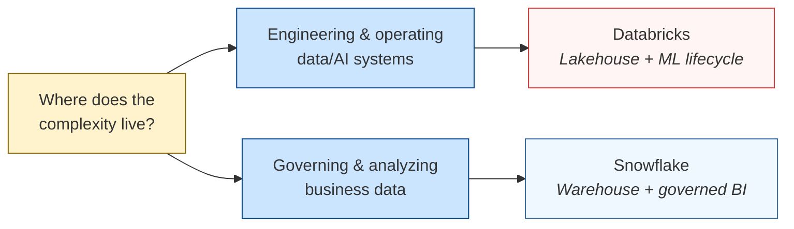

# A Decision Framework for Databricks vs Snowflake

How to actually pick. Not a service-mapping exercise — a set of discovery questions you can take to a real workload, paired with the architectural reason each question matters and the evidence in *this* repo that backs the claim.

> **TL;DR:** *If the complexity is in pipelines, features, models, agents, tracing, and lifecycle governance → Databricks. If the complexity is mostly governed SQL analytics over curated warehouse data → Snowflake.*

## Mental Model

| Platform | Positions itself as | Best when AI is… |
|---|---|---|
| **Snowflake** | AI brought to the governed warehouse | An *interface to data* (NL→SQL, embeddings over governed tables) |
| **Databricks** | AI/ML lifecycle built on the lakehouse | A *system you build, evaluate, deploy, and operate* |

Both *can* do the same things — that's table stakes. The interesting question is what each platform's defaults push you toward.

---

## How to Read This

Three layers, in order:

1. **[Discovery questions by phase](#table-1-discovery-questions-by-phase)** — what to ask the customer/team **before** recommending anything.
2. **[The 7 discovery questions](#the-seven-discovery-questions)** — the actual decision points. Each has a decision table and **evidence in this repo** that demonstrates the claim.
3. **[Decision matrices](#table-2-databricks-differentiation-anchors)** — quick-reference tables for the conversation.

If you're short on time, jump straight to **[Table 3 (Platform Fit Matrix)](#table-3-platform-fit-matrix)**.

---

## Table 1: Discovery Questions by Phase

Get the workload context before applying the framework. Without these answers, the rest is guessing.

| Phase | Focus | Key questions |
|---|---|---|
| **1. Business problem** | Outcome & success | What outcome? Current pain? Latency requirement? Success metric? |
| **2. Data & scale** | Volume & shape | What sources? Structured/unstructured? Volume, velocity, growth? Schema stability? |
| **3. Integration** | How data flows | Source format (API/files/DB/queue)? On-prem/cloud/hybrid? Native connectors? |
| **4. ML & analytics** | Workload type | Descriptive/predictive/real-time? Retrain cadence? Drift handling? |
| **5. Governance** | Compliance & access | GDPR/PCI? Access control? Retention? Audit + lineage requirements? |
| **6. Tooling & constraints** | Existing stack | Current tools (BI/ETL/ML)? Cloud/on-prem? Team skills? Budget? |

**Bonus question worth asking** (doesn't change *today's* recommendation, may change tomorrow's):

- What's the expected roadmap — pure SQL today + ML next quarter is a different recommendation than pure SQL forever.

---

## The Seven Discovery Questions

### 1. Where does the data start?

| If the answer is… | Lean toward | Architectural reason |
|---|---|---|
| Raw logs, files from S3, Kafka, semi-structured JSON, mixed sources | **Databricks** | Auto Loader infers schemas on first sight, evolves them as files arrive, and rescues unknown fields. Schema-on-read is a first-class concern. |
| Curated warehouse tables, well-typed CDC, BI extracts, analyst-managed sources | **Snowflake** | `COPY INTO` requires target columns declared upfront. Schema mismatches are hard errors unless you wrote the COPY transform defensively. |

**Evidence in this repo:**

- `data_generation/dirt.py` — produces a v1→v2 schema evolution where `amt` is renamed to `transaction_amount` and `device_id` is added.
- **Databricks side** — `databricks/notebooks/02_autoloader_bronze.py` picks up v2 columns automatically with `cloudFiles.schemaEvolutionMode=addNewColumns`. Zero code changes.
- **Snowflake side** — `snowflake/ddl/01_setup.sql` had to declare *all* columns from both v1 and v2 schemas upfront. `snowflake/notebooks/02_bronze_copy.sql` runs two separate `COPY INTO` statements, one per schema version.
- **Punchline:** both produced the same downstream silver table, but Snowflake required me to know the future schema in advance and Databricks didn't.

---

### 2. What is the AI use case?

| If the answer is… | Lean toward | Architectural reason |
|---|---|---|
| Custom ML, RAG over private data, agent workflows, feature pipelines, retraining | **Databricks** | Treats AI as a *system to engineer* — Spark for features, MLflow for tracking, Model Serving for endpoints, Unity Catalog spans tables + features + models + vector indexes. |
| Natural-language BI, embedding search over governed tables, LLM-as-SQL-function | **Snowflake** | Treats AI as a *function call from the warehouse* — `SNOWFLAKE.CORTEX.COMPLETE(...)`, `SNOWFLAKE.CORTEX.SEARCH(...)`. Lower friction for analysts. |

**Evidence in this repo:**

- `dbt/models/gold/gold_dim_customer_risk.sql` — rule-based risk score, intentionally not ML. Demonstrates the *shape* of where a model would live (per-customer features → score) without training one.
- **Promoting to ML on Databricks:** add a notebook that reads the same silver tables, trains a classifier, logs to MLflow, serves via Model Serving. **One workspace.**
- **Promoting to ML on Snowflake:** either call Cortex from a SQL function, OR export features to a Snowpark Python session, train, register in Snowflake's model registry. **Two surfaces (SQL + Snowpark).**
- **Punchline:** Databricks's ML path is a single workspace conversation. Snowflake's crosses surfaces.

---

### 3. What must be governed?

| If the governed estate is… | Lean toward | Architectural reason |
|---|---|---|
| Tables + files + ML features + model versions + serving endpoints + vector indexes + notebooks + agents | **Databricks (Unity Catalog)** | UC's surface area is broader because Databricks ships ML and notebooks as first-class governable objects. |
| Tables + views + business metrics + row policies + column masks + dashboards | **Snowflake (Horizon)** | Narrower scope but cleaner primitives — masking-policy and row-access-policy syntax is arguably more elegant than UC's function-based masking. |

**Evidence in this repo:**

The same masking problem solved two ways:

| Aspect | Databricks | Snowflake |
|---|---|---|
| Implementation file | `databricks/notebooks/04_setup_security.sql` | `snowflake/notebooks/04_setup_security.sql` |
| Mask definition | SQL function `mask_cc_num(val)` | `CREATE MASKING POLICY mask_cc_num` |
| Authorization signal | `is_account_group_member('npl_pii_reader')` | `current_role() IN ('NPL_PII_READER', 'ACCOUNTADMIN')` |
| Binding syntax | `ALTER TABLE ... ALTER COLUMN ... SET MASK` | `ALTER TABLE ... MODIFY COLUMN ... SET MASKING POLICY` |
| Unit of authorization | Group membership (per-user, queried at runtime) | Active role (token-bound on Snowflake PATs) |

- **Punchline:** architecturally similar; the unit of authorization differs (group vs role), and that matters for how you'd design the surrounding access management.

---

### 4. Who builds it?

| If the team is… | Lean toward | Architectural reason |
|---|---|---|
| Data engineers, ML engineers, data scientists, platform engineers — comfortable in Python/Spark/notebooks | **Databricks** | Defaults assume Python/Spark at some point. Notebooks are the IDE; ML training lives next to ETL. |
| SQL analysts, analytics engineers, BI developers — comfortable in dbt + Snowsight | **Snowflake** | SQL is the lingua franca. Python (Snowpark) and Streamlit work fine but feel like bolt-ons. |

**Evidence in this repo:**

The dashboard implementations make this concrete:

| | Databricks (Lakeview) | Snowflake (Streamlit-in-Snowflake) |
|---|---|---|
| File | `databricks/dashboards/fraud_overview.lvdash.json` | `snowflake/streamlit/fraud_overview.py` |
| Format | JSON (undocumented widget schema) | Python (`st.metric`, `st.dataframe`) |
| Best read by | A frontend engineer who'll crib widget specs from working dashboards | A Python developer who'll modify, test, debug it |
| Fragile when… | Lakeview's JSON schema drifts (it does — see `project_m2c_findings.md`) | Streamlit version skew between local and SiS environment |

- **Punchline:** A Python dev finds Streamlit easier to read and modify. A SQL analyst finds Lakeview JSON opaque. Neither is wrong — they're tuned for different audiences.

---

### 5. What must be debugged?

| If "debugging" means… | Lean toward | Architectural reason |
|---|---|---|
| Wrong model output, bad retrieved docs, feature drift, agent traces, model A vs B | **Databricks** | MLflow tracking + evaluation + tracing + lineage that crosses ML artifacts. |
| Slow SQL, mismatched metric, "user can't see this column," stale dashboard | **Snowflake** | Query Profile (visual EXPLAIN), `ACCOUNT_USAGE.QUERY_HISTORY`, `ACCESS_HISTORY`. Cleaner SQL semantics. |

**Evidence in this repo:**

- `scripts/parity_check.py` runs 4 reference queries against each platform.
- First run: Snowflake silver was off by 2 rows out of 96,987 — a non-deterministic dedup tie.
- **Diagnosing on Snowflake:** opened Query Profile, read the ROW_NUMBER plan. Faster.
- **Diagnosing on Databricks:** ran the same query in a notebook, `.display()`'d the intermediate CTE. Worked too.
- **Punchline:** for *pure SQL*, Snowflake's debugging surface is faster. The moment ML enters, Databricks pulls ahead — MLflow has no Snowflake equivalent.

---

### 6. What is the latency pattern?

| If the answer is… | Lean toward | Architectural reason |
|---|---|---|
| Streaming or near-real-time features/predictions (ms→s) | **Databricks** | Structured Streaming is first-class; same code works batch and stream. DLT wraps it declaratively. |
| Scheduled batch (daily/hourly) BI dashboards from overnight loads | **Snowflake** | Warehouses + Dynamic Tables are tuned for batch. Snowpipe Streaming exists but isn't the default. |

**Evidence in this repo:**

| | Databricks | Snowflake |
|---|---|---|
| Bronze ingest file | `databricks/notebooks/02_autoloader_bronze.py` | `snowflake/notebooks/02_bronze_copy.sql` |
| Pattern | Auto Loader (`cloudFiles`) — a streaming Spark source | `COPY INTO` — inherently batch (one file/execution) |
| Path to streaming | Flip one option (`trigger=continuous`) | Different ingestion architecture: Snowpipe auto-ingest needs S3 + SNS |

- **Punchline:** on Databricks the path from batch → streaming is a flag flip. On Snowflake it's an architecture change.

---

### 7. What does success look like?

| If success means… | Lean toward | Architectural reason |
|---|---|---|
| "We built a reusable AI/data platform other teams will adopt" | **Databricks** | Platform-flexible; Spark absorbs new workload types you didn't predict; UC governs across teams. |
| "Business users adopted dashboards and metrics fast" | **Snowflake** | Lower operational burden; warehouses scale concurrency without per-team contention; analysts self-serve. |

**Evidence in this repo:**

- `databricks/notebooks/cost_tracking.py` queries `system.billing.usage` — needs **custom tags** to attribute spend cleanly. Untagged compute (e.g. shared SQL warehouses) gets missed.
- `snowflake/notebooks/cost_tracking.sql` queries `SNOWFLAKE.ACCOUNT_USAGE.WAREHOUSE_METERING_HISTORY` — attributes by `warehouse_name`, which is straightforward when warehouses map 1:1 to projects.
- **Punchline:** Snowflake's cost model is simpler because the platform pushes you toward one warehouse per project. Databricks's is more flexible but you build the cost-attribution discipline yourself.

---

## Table 2: Databricks Differentiation Anchors

When Databricks is the answer, lead with the relevant anchor below. The third column is the conversational signal that tells you it's the right anchor for *this* conversation.

| Anchor | What it means | Bring this out when… |
|---|---|---|
| **Unified data + ML + analytics** | One platform: ingestion, transformation, training, serving | They mention tool sprawl or "data has to move between three systems" |
| **Custom ML at scale** | Spark-native training in Python/Scala/R, not just pre-built models | They need bespoke models, not Cortex-style managed AI |
| **Diverse data types** | Structured + unstructured (images, video, text) in one pipeline | The use case mixes transactions with media or logs |
| **Streaming + batch unified** | Auto Loader, Structured Streaming, same code both modes | They need real-time AND historical from the same code path |
| **Governance at scale** | Unity Catalog covers data + features + models + notebooks | Multi-team data sharing or ML artifact governance matters |
| **Cost efficiency for ML** | GPU support, autoscaling, no separate message bus needed | Budget is tight or current ML infra is sprawling |
| **MLOps simplicity** | MLflow + DLT + Jobs + drift detection — all native | High retrain frequency or low MLOps maturity today |

**Mirror anchors for Snowflake:**

| Anchor | What it means | Bring this out when… |
|---|---|---|
| **Zero-ops warehouse** | XS→XXL with auto-suspend; no Spark cluster tuning | Team wants to ship analytics, not operate infrastructure |
| **Concurrency at scale** | Multi-cluster warehouses isolate BI from ETL workloads | Many concurrent dashboard users; ETL/BI compete for resources today |
| **Cortex (AI for analysts)** | LLM-as-SQL-function: `CORTEX.COMPLETE`, `CORTEX.SEARCH` | Analysts want AI without learning Python or owning model lifecycle |
| **Data sharing** | Native cross-account secure shares, no copy/extract | Sharing governed data with partners, customers, or other tenants |
| **Horizon governance** | Masking policies, row access policies, tags, ACCESS_HISTORY | Strict access controls + audit on warehouse-resident data |

---

## Table 3: Platform Fit Matrix

The four major options. Anything not here is a niche play or a managed-service-on-top that doesn't change the architectural conversation.

| Platform | Strong fit when… | Weak fit when… |
|---|---|---|
| **Databricks** | • Custom ML • Mixed data types (structured + unstructured) • Frequent retraining • Streaming + batch unified • Lineage across ML artifacts matters | • Pure SQL analytics, no ML • Small datasets (< ~100 GB) • Team is SQL-only with no Python comfort |
| **Snowflake** | • SQL-first analytics • Pre-built AI through Cortex • Managed-simplicity prized over flexibility • Analyst-heavy team • Governance over warehouse + BI estate | • Heavy custom ML • Large-scale unstructured data (images/video at PB) • Complex feature engineering • Lakehouse (Iceberg/Delta) as source of truth |
| **BigQuery** | • GCP-native shop • Analytical SQL workloads • Deep Vertex AI integration • BI Engine for sub-second dashboards | • Multi-cloud strategy • Lakehouse patterns (data in S3/ADLS) • Deep custom ML outside Vertex |
| **Redshift** | • AWS-native shop • Pure data-warehouse workloads • Tight integration with Glue/QuickSight | • Lakehouse architecture • ML-first workloads • Schema flexibility • Multi-cloud |

> **Why a 4-way matrix?** Most real conversations are *not* Databricks vs Snowflake. They're "we're already on AWS — Redshift, Snowflake, or Databricks?" or "we're a GCP shop — does BigQuery cover us, or do we need Databricks for ML?" Knowing the cross-axes prevents recommending the wrong tool because you only knew two.

---

## Worked Example: Apply It to NorthWind

The fictional fraud-analytics workload built in this repo, run through the framework:

| # | Question | NorthWind's answer | Signal |
|---|---|---|---|
| 1 | Where does data start? | Raw transaction files with deliberate dirt (nulls, dupes, schema v1→v2, currency strings) | → Databricks |
| 2 | AI use case? | Rule-based risk score today; ML classifier is documented stretch | → Databricks (lifecycle), Snowflake-with-Cortex viable |
| 3 | What must be governed? | PII columns; 6 mask bindings | → Both adequate; UC broader, Horizon cleaner |
| 4 | Who builds it? | One person comfortable in both Python and SQL | → Either; not a tiebreaker |
| 5 | What must be debugged? | dbt test failures, parity drift, mask regressions | → Both adequate; Snowflake faster for pure-SQL |
| 6 | Latency pattern? | Batch (daily KPI); real-time auth scoring is stretch | → Snowflake fine today; Databricks if real-time roadmap |
| 7 | Success metric? | Reproducible side-by-side comparison; portfolio artifact | → Either |

**Recommendation:**

- **No real-time roadmap** → Snowflake marginally cheaper to operate.
- **Real-time on roadmap** → Databricks, because streaming + ML is integrated rather than bolted on.
- **In practice** → "either is fine" — which is *exactly* what the parity check confirms (same dbt SQL, byte-identical gold). The framework's job is to make that "either is fine" honest rather than handwavy.

---

## When the Framework Doesn't Help

The framework is for **new** architecture decisions. It doesn't help with:

- **Migrations.** Moving an existing Snowflake estate to Databricks (or vice versa) is mostly about migration cost and team skill transition, not platform fit.
- **Multi-platform reality.** Many large orgs run both. The framework collapses to "what workload should live where?" — usually ML and unstructured on Databricks, BI and governed analytics on Snowflake.
- **Pricing-driven decisions.** Both platforms negotiate. Sticker price tells you nothing about the contract you'll actually get.

---

## Source

- Companion doc: [`docs/architecture-comparison.md`](architecture-comparison.md) — the *what I built* version. This doc is the *how to choose* version. Use them together.
- Repo root: [`README.md`](../README.md) — quickstart and structure.
