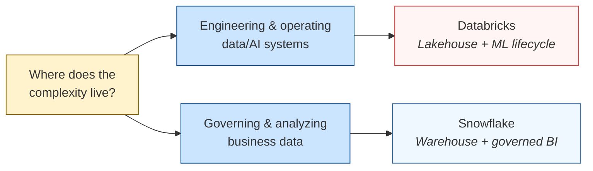

# A Decision Framework for Databricks vs Snowflake

How to actually pick. Not a service-mapping exercise — a set of discovery questions you can take to a real workload, paired with the architectural reason each question matters and the evidence in *this* repo that backs the claim.

> **TL;DR:** *If the complexity is in pipelines, features, models, agents, tracing, and lifecycle governance, lean Databricks. If the complexity is mostly governed SQL analytics over curated warehouse data, Snowflake may be the cleaner fit.*

The two platforms are not interchangeable. They both *can* do the same things — that's table stakes — but their architectural defaults push you toward different operating models. The honest framing:

- **Snowflake** = AI brought to the governed warehouse. AI is an *interface to data*.
- **Databricks** = AI/ML lifecycle built on the lakehouse. AI is a *system you build, evaluate, deploy, and operate*.

This document is the framework I use when sizing up an unfamiliar workload. Every question links to specific evidence in this repo's code so the reasoning is reproducible, not asserted.

---

## How to Read This

The framework has three layers:

1. **Discovery questions by phase** ([Table 1](#table-1-discovery-questions-by-phase)) — what to ask before recommending anything. Six phases, scoped to the architecture-decision conversation.
2. **The seven discovery questions** ([§1–§7](#1-where-does-the-data-start)) — the actual decision points. Each has the question, what each answer signals, the architectural reason, and **evidence from this repo** that demonstrates the difference is real.
3. **Decision matrices** ([Table 2](#table-2-databricks-differentiation-anchors), [Table 3](#table-3-platform-fit-matrix)) — quick-reference tables: when to anchor on each Databricks differentiator, and where each platform (Databricks, Snowflake, BigQuery, Redshift) fits or doesn't.

---

## Table 1: Discovery Questions by Phase

Before applying the framework, get the workload context. These are the questions that have to be answered first — without them, the rest of the framework is just guessing.

| Phase | Focus | Key questions to ask |
|---|---|---|
| **1. Business problem** | Outcome & success | What outcome are they chasing? What's the current pain? What's the latency requirement? How will they measure success? |
| **2. Data & scale** | Volume & shape | What sources exist? Structured/unstructured? Volume, velocity, growth? Schema stability? Seasonality? |
| **3. Integration** | How data flows | How do sources expose data (API, files, DB, queue)? On-prem, cloud, hybrid? Native connectors available? |
| **4. ML & analytics** | Workload type | Descriptive, predictive, or real-time scoring? Retrain cadence? Model lifecycle owner? Drift handling? |
| **5. Governance** | Compliance & access | Regulatory context (GDPR, PCI)? Access control needs? Retention? Audit and lineage requirements? |
| **6. Tooling & constraints** | Existing stack | What tools today (BI, ETL, ML)? Cloud-native or on-prem? Team skill profile? Budget constraints? |

Also worth asking, even if it doesn't change the recommendation today: **What's the expected roadmap?** A workload that's pure SQL today but adding ML next quarter is a different recommendation than a workload that's pure SQL forever.

---

## The Seven Discovery Questions

Each section follows the same shape: the question, what each answer points to, the architectural *why*, and the **evidence in this repo** that lets you verify the claim instead of taking it on faith.

### 1. Where does the data start?

**If the answer is** raw logs, files from S3, Kafka topics, semi-structured JSON, messy mixed sources → **Databricks**.
**If the answer is** curated warehouse tables, well-typed CDC feeds, BI extracts, analyst-managed sources → **Snowflake**.

**Why:** Databricks treats schema-on-read as a first-class concern. Auto Loader infers schemas on first sight, evolves them as new files arrive, and falls back to a `_rescued_data` column for fields it can't type. The Delta format on object storage means you can ingest first and ask questions later. Snowflake's `COPY INTO` is the inverse: target columns must be declared *before* the COPY runs, and a schema mismatch is a hard error unless you wrote the COPY transform defensively.

**Evidence in this repo:** the synthetic data generator at `data_generation/dirt.py` produces six modes of deliberate dirt — including a v1→v2 schema evolution where the `amt` column gets renamed to `transaction_amount` and a new `device_id` column is added. On the Databricks side (`databricks/notebooks/02_autoloader_bronze.py`), Auto Loader picked up the v2 columns automatically with `cloudFiles.schemaEvolutionMode=addNewColumns`. On the Snowflake side (`snowflake/ddl/01_setup.sql`), I had to declare *all* columns from both v1 and v2 schemas in the bronze table DDL upfront, then write two separate `COPY INTO` statements (one per schema version) in `snowflake/notebooks/02_bronze_copy.sql`. Both produced the same downstream silver table — but Snowflake required me to know the future schema in advance, and Databricks didn't.

### 2. What is the AI use case?

**If the answer is** custom ML, RAG over private data, agent workflows, feature pipelines, retraining on new data → **Databricks**.
**If the answer is** natural-language BI ("ask my warehouse a question"), embedding-based search over governed tables, SQL-functions-with-LLM-calls → **Snowflake**.

**Why:** Databricks treats the AI workload as a *system to be engineered* — Spark for feature pipelines, MLflow for tracking, Model Serving for endpoints, Unity Catalog for vector indexes alongside tables. Snowflake (Cortex) treats AI as a *function call from inside the warehouse* — `SNOWFLAKE.CORTEX.COMPLETE(...)`, `SNOWFLAKE.CORTEX.SEARCH(...)`. Both are valid; they target different consumers.

**Evidence in this repo:** the `gold_dim_customer_risk` model at `dbt/models/gold/gold_dim_customer_risk.sql` is a rule-based risk score — intentionally not ML. It demonstrates the *shape* of where a model would live (per-customer features → score), but stops short of training one. Promoting this from rules to ML on Databricks would mean adding a notebook that reads the same silver tables, trains a classifier, logs to MLflow, and serves predictions — entirely inside the workspace. On Snowflake the same upgrade would mean either calling out to Cortex from a SQL function or exporting features to a Snowpark Python session, training, and registering the model in the Snowflake model registry. The Databricks path is one workspace; the Snowflake path crosses two surfaces (SQL + Snowpark).

### 3. What must be governed?

**If the answer is** tables, files, ML features, model versions, serving endpoints, vector indexes, notebooks, agents — i.e. the full data + AI estate → **Databricks (Unity Catalog)**.
**If the answer is** tables, views, business metrics, row-level policies, column masks, dashboards — i.e. the warehouse + BI estate → **Snowflake (Horizon)**.

**Why:** Unity Catalog's surface area is broader because Databricks ships ML and notebooks as first-class objects — they need to be governed too. Horizon's surface area is narrower but deeper on the warehouse side: the masking-policy and row-access-policy primitives are arguably cleaner than UC's function-based masking, but they don't extend to ML artifacts because Snowflake's ML story is comparatively newer.

**Evidence in this repo:** the masking implementation at `databricks/notebooks/04_setup_security.sql` and `snowflake/notebooks/04_setup_security.sql` solves the same problem (mask `cc_num` to last-4, redact names, NULL out `dob`) two different ways. Databricks uses a SQL function `mask_cc_num(val)` that checks `is_account_group_member('npl_pii_reader')` and is bound to columns via `ALTER TABLE ... ALTER COLUMN ... SET MASK`. Snowflake uses `CREATE MASKING POLICY mask_cc_num AS (val STRING) RETURNS STRING -> CASE WHEN current_role() IN (...) THEN val ELSE ...` and binds via `ALTER TABLE ... MODIFY COLUMN ... SET MASKING POLICY`. Architecturally similar; the unit of authorization differs (group membership vs active role), and that matters for how you'd design the surrounding access management. The trade-off only becomes clear when you've implemented both — which is the point of this repo.

### 4. Who builds it?

**If the team is** data engineers, ML engineers, data scientists, platform engineers — comfortable in Python, Spark, notebooks → **Databricks**.
**If the team is** SQL analysts, analytics engineers, BI developers — comfortable in dbt and Snowsight worksheets, less so in Python → **Snowflake**.

**Why:** Databricks's defaults assume you'll write Python or Spark at some point. Notebooks are the IDE; jobs orchestrate Python and SQL together; ML training lives next to ETL. Snowflake's defaults assume SQL is the lingua franca; Python (Snowpark) and Streamlit are bolt-ons that work fine but feel like second-class citizens compared to a Snowsight worksheet.

**Evidence in this repo:** the dashboard implementations make this concrete. On Databricks, the Lakeview dashboard at `databricks/dashboards/fraud_overview.lvdash.json` is JSON — code-deployable, source-controllable, but the schema is undocumented and you crib widget specs from working dashboards (see the M2c findings note in the comparison doc). On Snowflake, the dashboard at `snowflake/streamlit/fraud_overview.py` is a Python Streamlit app that calls `session.sql()` and renders with `st.metric()` and `st.dataframe()`. A Python developer will find the Streamlit version *easier* to read, modify, and debug. A SQL analyst will find the Lakeview JSON shape opaque. Neither is wrong — they're tuned for different audiences.

### 5. What must be debugged?

**If debugging means** "the model output is wrong," "the wrong docs are being retrieved," "this feature drifted," "trace this agent's decision," "compare model version A to B" → **Databricks (MLflow + tracing + feature store)**.
**If debugging means** "this SQL is slow," "this metric doesn't match the dashboard," "this user can't see this column," "why is this dashboard returning stale data" → **Snowflake (Query Profile + ACCESS_HISTORY + clean SQL semantics)**.

**Why:** the platform's debugging tools mirror its primary workload. Databricks invests in MLflow tracking, model evaluation, vector-search tracing, and lineage that crosses ML artifacts. Snowflake invests in Query Profile (the visual EXPLAIN), `ACCOUNT_USAGE.QUERY_HISTORY`, `ACCESS_HISTORY` for "who saw what," and a generally cleaner SQL surface where the answer to "why is this query slow" tends to be a one-liner.

**Evidence in this repo:** the cross-platform parity check at `scripts/parity_check.py` runs four queries against each platform and asserts the gold tables match within 1e-4 tolerance. When I first ran it, the Snowflake silver count was off by 2 rows out of 96,987 — a non-deterministic dedup tie. Diagnosing that on Snowflake meant opening Query Profile and reading the ROW_NUMBER plan; on Databricks it meant running the same query in a notebook and `.display()`-ing the intermediate CTE. Both worked. Snowflake's was faster to navigate because the workload was pure SQL — Databricks would pull ahead the moment ML enters the picture.

### 6. What is the latency pattern?

**If the answer is** streaming or near-real-time features and predictions (sub-second to seconds) → **Databricks (Structured Streaming + DLT + Model Serving)**.
**If the answer is** scheduled batch analytics, mostly-daily-or-hourly refreshes, BI dashboards driven by overnight loads → **Snowflake (warehouses + Dynamic Tables + Snowpipe Streaming for ingest only)**.

**Why:** Databricks ships Structured Streaming as a first-class API, with the same code working for batch and stream. Delta Live Tables wraps it in a declarative-pipeline pattern. Snowflake's streaming story is newer (Snowpipe Streaming for ingest, Dynamic Tables for declarative refresh) and not as integrated — you can build sub-minute pipelines but it's not the platform's defaults.

**Evidence in this repo:** the bronze ingest pattern documents this explicitly. On Databricks, `databricks/notebooks/02_autoloader_bronze.py` uses `cloudFiles` (Auto Loader) which is a streaming Spark source — the same code would work in continuous-streaming mode by changing one option. On Snowflake, `snowflake/notebooks/02_bronze_copy.sql` uses `COPY INTO` which is inherently batch (one file per execution); the streaming equivalent would be Snowpipe auto-ingest with S3 + SNS, which I documented but didn't build because it's out of scope for a free-trial setup. The point: on Databricks the path from batch to streaming is a flag flip; on Snowflake it's a different ingestion architecture entirely.

### 7. What does success look like?

**If success means** "we built a reusable AI/data platform that other teams will adopt" → **Databricks** (it positions itself as a platform; Unity Catalog spans the org; Spark can absorb new workload types).
**If success means** "business users adopted the dashboards and metrics fast" → **Snowflake** (warehouses scale concurrency without per-team contention; Snowsight is approachable; SQL-first orgs ramp quickly).

**Why:** the unit of organizational success differs. A platform team that wants to build *infrastructure* will appreciate Databricks's flexibility (every workload fits, even ones you didn't predict). A BI team that wants to ship *value* will appreciate Snowflake's lower operational burden (no compute config to think about; auto-suspend handles cost; analysts can self-serve).

**Evidence in this repo:** the cost-tracking notebooks at `databricks/notebooks/cost_tracking.py` and `snowflake/notebooks/cost_tracking.sql` query each platform's billing surface. The Databricks query (`system.billing.usage`) needs custom tags to attribute spend cleanly — the M1 cost notebook only catches *tagged* compute, missing the SQL warehouse spend that's shared across the workspace (see project memory `project_m2c_findings.md` finding 5). The Snowflake query (`SNOWFLAKE.ACCOUNT_USAGE.WAREHOUSE_METERING_HISTORY`) attributes by warehouse name, which is straightforward when warehouses map 1:1 to projects. The Snowflake model is simpler because the platform pushes you toward one warehouse per project; the Databricks model is more flexible but requires you to build the cost-attribution discipline yourself.

---

## Table 2: Databricks Differentiation Anchors

When you've decided Databricks is the answer, these are the architectural anchors to lead with — and the conversational signal that tells you it's time to bring each one out.

| Anchor | What it means | Conversational signal: bring this out when… |
|---|---|---|
| **Unified data + ML + analytics** | One platform — ingestion, transformation, training, serving | The prospect mentions tool sprawl or "data has to move between three systems" |
| **Custom ML at scale** | Spark-native training, Python/Scala/R, not just pre-built models | They need bespoke models, not Cortex-style managed AI functions |
| **Diverse data types** | Structured + unstructured (images, video, text) in one pipeline | The use case mixes transactional data with media, logs, or documents |
| **Streaming + batch unified** | Auto Loader, Structured Streaming, same code for both modes | They need real-time AND historical analytics from the same code path |
| **Governance at scale** | Unity Catalog — access, lineage, quality, ML artifacts in one place | Compliance, multi-team data sharing, or ML artifact governance matters |
| **Cost efficiency for ML** | GPU support, autoscaling, no separate message bus needed | Budget is tight or current ML infra is sprawling |
| **MLOps simplicity** | MLflow, DLT, Jobs, drift detection — all native | Retraining frequency is high or MLOps maturity is low |

**Mirror anchor for Snowflake (when Snowflake is the answer):**

| Anchor | What it means | When to bring it out |
|---|---|---|
| **Zero-ops warehouse** | XS-to-XXL warehouses with auto-suspend; no Spark cluster tuning | Team wants to ship analytics, not operate infrastructure |
| **Concurrency at scale** | Multi-cluster warehouses isolate BI workloads from ETL workloads | Many concurrent dashboard users; ETL and BI compete for resources today |
| **Cortex (AI for analysts)** | LLM-as-SQL-function: `CORTEX.COMPLETE(...)`, `CORTEX.SEARCH(...)` | Analysts want AI without learning Python or owning model lifecycle |
| **Data sharing** | Native cross-account secure data shares without copy/extract | Need to share governed data with partners, customers, or other tenants |
| **Horizon governance** | Masking policies, row access policies, tags, ACCESS_HISTORY | Strict access controls on warehouse-resident data; auditability matters |

---

## Table 3: Platform Fit Matrix

Extended to the four major options. Anything not listed here is either a niche play or a managed-service-on-top that doesn't change the architectural conversation.

| Platform | Strong fit when… | Weak fit when… |
|---|---|---|
| **Databricks** | Custom ML, mixed data types (structured + unstructured), frequent retraining, streaming + batch unified, lineage across ML artifacts matters | Pure SQL analytics with no ML aspiration, small datasets (under ~100 GB), team is SQL-only with no Python comfort |
| **Snowflake** | SQL-first analytics, pre-built AI through Cortex, managed-simplicity prized over flexibility, analyst-heavy team, governance over the warehouse + BI estate | Heavy custom ML, large-scale unstructured data (images/video at petabyte scale), complex feature engineering pipelines, lakehouse (Iceberg/Delta) as the source of truth |
| **BigQuery** | GCP-native shop, analytical SQL workloads, deep Vertex AI integration, BI Engine for sub-second dashboards | Multi-cloud strategy, lakehouse patterns where data lives in S3/ADLS, deep custom ML outside Vertex |
| **Redshift** | AWS-native shop, pure data-warehouse workloads, tight integration with the rest of AWS analytics (Glue, QuickSight) | Lakehouse architecture, ML-first workloads, schema flexibility, multi-cloud |

The four-way matrix matters because *most real conversations are not Databricks vs Snowflake*. They're "we're already on AWS — Redshift, Snowflake, or Databricks?" or "we're a GCP shop — does BigQuery cover us, or do we need to add Databricks for ML?" Knowing the cross-axes prevents the trap of recommending the wrong tool because you only knew two.

---

## Putting It Together: A Worked Example

Apply the framework to the workload built in this repo — NorthWind Payments fraud analytics.

| Discovery question | NorthWind's answer | Signal |
|---|---|---|
| **1. Where does data start?** | Raw transaction files with deliberate dirt (nulls, dupes, schema evolution v1→v2, currency-formatted strings) | → Databricks |
| **2. AI use case?** | Rule-based risk score today; ML-based fraud classifier is a documented stretch | → Databricks (lifecycle), but Snowflake-with-Cortex is viable |
| **3. What must be governed?** | PII columns (cc_num, names, dob, street); 6 mask bindings across customer + transaction tables | → Both adequate; UC slightly broader, Horizon slightly cleaner |
| **4. Who builds it?** | One person (this repo's author) — comfortable in both Python and SQL | → Either; not a tiebreaker |
| **5. What must be debugged?** | dbt test failures, parity check drift between platforms, mask binding regressions after dbt rebuilds | → Both adequate; Snowflake faster for pure-SQL debugging |
| **6. Latency pattern?** | Batch (daily KPI refresh); real-time fraud auth scoring documented as stretch | → Snowflake fine for today; Databricks if real-time is roadmap |
| **7. Success metric?** | Reproducible side-by-side comparison; portfolio artifact | → Either |

**Recommendation:** if NorthWind were a real company *today* with no near-term real-time aspiration, Snowflake would be marginally cheaper to operate. If the roadmap includes real-time auth-flow scoring or in-house ML, Databricks is the safer long-term bet because the streaming-and-ML path is integrated rather than bolted on.

In practice, the answer for this specific workload is "either is fine" — which is *exactly* what the parity check confirms. The framework's job is to make that "either is fine" honest rather than handwavy.

---

## When the Framework Doesn't Help

The framework is for *new* architecture decisions. It doesn't help with:

- **Migrations.** Moving an existing Snowflake estate to Databricks (or vice versa) is mostly about migration cost and team skill transition, not platform fit. The framework tells you the destination platform is a fit; it doesn't tell you whether the migration is worth it.
- **Multi-platform reality.** Many large orgs run both. The framework collapses to "what workload should live where?" — usually ML and unstructured on Databricks, BI and governed analytics on Snowflake.
- **Pricing-driven decisions.** Both platforms negotiate. Sticker price tells you nothing about the contract you'll actually get.

---

## Source

- Companion doc: [`docs/architecture-comparison.md`](architecture-comparison.md) — the *what I built* version. This doc is the *how to choose* version. Use them together.
- Repo root: [`README.md`](../README.md) — quickstart and structure.
